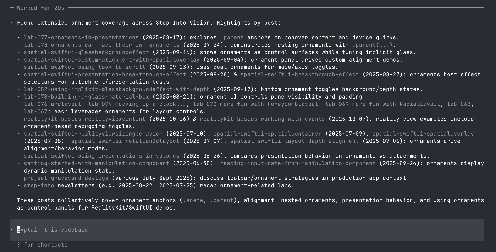

# Step Into Vision MCP


This repository packages a Swift-first toolchain for exploring Step Into Vision content. Everything you need to ingest data and serve it over the Model Context Protocol lives in the Swift package so you can stay in one toolchain from start to finish.

## Requirements

- Swift 6.1 (available via Xcode 16 or the Swift 6 toolchains)

## Repository Layout

- `swift/StepIntoVisionMCP/` – Swift-only ingestion + MCP server built on the official Model Context Protocol Swift SDK and sqlite-data
- `data/` – empty folder kept for your local SQLite database (ignored by git)

## Swift Quick Start

The Swift tooling is self-contained: it ingests the Step Into Vision WordPress feed, stores it with sqlite-data, and serves the tools over STDIO.

1. **Build (or fetch dependencies)**

   ```bash
   swift build --package-path swift/StepIntoVisionMCP
   ```

2. **Ingest the Step Into Vision catalog**

   ```bash
   swift run --package-path swift/StepIntoVisionMCP stepinto-swift-ingest --db data/stepinto.db
   ```

   Use `--help` for options such as `--base-url`, `--per-page`, or incremental syncs with `--modified-after`.

3. **Serve the MCP tools over STDIO**

   ```bash
   swift run --package-path swift/StepIntoVisionMCP stepinto-swift-mcp --db data/stepinto.db
   ```

   Add `--verbose` to watch requests stream by.

4. **Connect from an MCP client**

   - **`gpt5-codex`** `config.toml` example:

     ```toml
     [mcp_servers.StepIntoVision]
     command = "/path/to/stepintovision.ai/swift/StepIntoVisionMCP/.build/debug/stepinto-swift-mcp"
     args    = ["--db", "/path/to/stepintovision.ai/data/stepinto.db"]
     ```

  - **`Companion` CLI** example (STDIO transport by default):

    ```bash
    companion --server /path/to/stepintovision.ai/swift/StepIntoVisionMCP/.build/debug/stepinto-swift-mcp \
      --server-argument --db \
      --server-argument /path/to/stepintovision.ai/data/stepinto.db
    ```

   Companion will connect over STDIO and list the three Step Into Vision tools (`list_posts`, `get_post`, `search_posts`) after the handshake. Run `tools` inside the Companion prompt to verify everything registered correctly before issuing tool calls.

5. **Run the Swift tests whenever you touch the core library**

   ```bash
   swift test --package-path swift/StepIntoVisionMCP
   ```

## Available Tools

- `list_posts(limit=10, offset=0, category_slug=None, tag_slug=None)` – paginated listing of recent articles.
- `get_post(slug=None, post_id=None, include_html=False, include_text=True)` – fetch a single record.
- `search_posts(query, limit=10, offset=0, include_html=False)` – keyword search across title, excerpt, tags, and body.

All responses include canonical URLs so that downstream consumers can cite the original content.

## Data Storage

The `data/` directory is intentionally empty in git; each user generates their own `stepinto.db` via the ingestion CLI.
